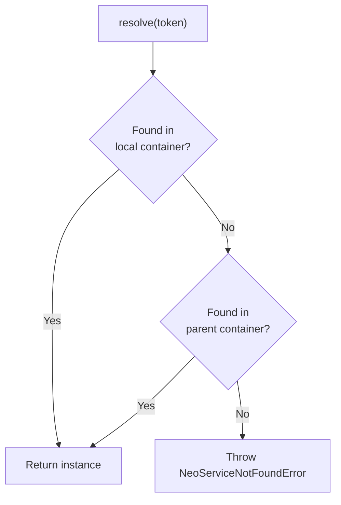

# Parent Container

Build hierarchical container architectures with `useContainer`.

## Overview

NeoSyringe supports parent containers for:

- **SharedKernel pattern**: Core services shared across bounded contexts
- **Modular architecture**: Each module has its own container
- **Testing**: Override production services with mocks

::: tip `useContainer` vs. `extends` — different tools for different jobs
`useContainer` shares **instances**: the child resolves the *same singleton object* the parent already created (`sharedKernel`'s `ConsoleLogger` instance and `userModule`'s `ConsoleLogger` instance are identical). `extends` (with `definePartialConfig`) shares **recipes**: each container that `extends` a partial gets its *own, independent* instances from the same registrations — nothing is shared at runtime. If two modules must observe the same event bus instance, use `useContainer`. If they just want to avoid repeating the same boilerplate registrations but don't need shared state, use `extends`. See [Multiple Containers per File](./multi-containers.md#shared-kernel-pattern) for the `extends` version of this pattern.
:::

`useContainer` works whether the parent lives in the same file or a different one — the same-file case just needs each `defineBuilderConfig` call assigned to its own variable (see [Multiple Containers per File](./multi-containers.md)).

## Basic Usage

```typescript
import { defineBuilderConfig, useInterface } from '@djodjonx/neosyringe';

// Parent container
const sharedKernel = defineBuilderConfig({
  name: 'SharedKernel',
  injections: [
    { token: useInterface<ILogger>(), provider: ConsoleLogger },
    { token: useInterface<IEventBus>(), provider: InMemoryEventBus }
  ]
});

// Child container
const userModule = defineBuilderConfig({
  name: 'UserModule',
  useContainer: sharedKernel,  // 👈 Inherit from parent
  injections: [
    { token: UserRepository },
    { token: UserService }     // Can use ILogger and IEventBus!
  ]
});
```

## Resolution Order

When you call `resolve()`, NeoSyringe looks up the token in this order:



## SharedKernel Architecture

Perfect for Domain-Driven Design with shared infrastructure:

```typescript
// shared-kernel/container.ts
export interface ILogger {
  log(msg: string): void;
}

export interface IEventBus {
  publish(event: any): void;
}

class ConsoleLogger implements ILogger {
  log(msg: string) { console.log(`[LOG] ${msg}`); }
}

class InMemoryEventBus implements IEventBus {
  publish(event: any) { console.log('Event:', event); }
}

export const sharedKernel = defineBuilderConfig({
  name: 'SharedKernel',
  injections: [
    { token: useInterface<ILogger>(), provider: ConsoleLogger },
    { token: useInterface<IEventBus>(), provider: InMemoryEventBus }
  ]
});
```

```typescript
// user-module/container.ts
import { sharedKernel, ILogger, IEventBus } from '../shared-kernel';

class UserRepository {
  constructor(private logger: ILogger) {}
  
  findById(id: string) {
    this.logger.log(`Finding user ${id}`);
    return { id, name: 'John' };
  }
}

class UserService {
  constructor(
    private logger: ILogger,      // From SharedKernel
    private eventBus: IEventBus,  // From SharedKernel
    private repo: UserRepository  // Local
  ) {}
  
  createUser(name: string) {
    const user = { id: crypto.randomUUID(), name };
    this.logger.log(`Creating user: ${name}`);
    this.eventBus.publish({ type: 'UserCreated', user });
    return user;
  }
}

export const userModule = defineBuilderConfig({
  name: 'UserModule',
  useContainer: sharedKernel,
  injections: [
    { token: UserRepository },
    { token: UserService }
  ]
});
```

```typescript
// order-module/container.ts
import { sharedKernel, ILogger } from '../shared-kernel';

class OrderService {
  constructor(private logger: ILogger) {}  // From SharedKernel
}

export const orderModule = defineBuilderConfig({
  name: 'OrderModule',
  useContainer: sharedKernel,
  injections: [
    { token: OrderService }
  ]
});
```

```typescript
// main.ts
import { userModule } from './user-module/container';
import { orderModule } from './order-module/container';

// Both modules share the same ILogger and IEventBus instances!
const userService = userModule.resolve(UserService);
const orderService = orderModule.resolve(OrderService);
```

## Multi-Level Hierarchy

Chain containers for complex architectures:

```typescript
// Level 1: Infrastructure
const infrastructure = defineBuilderConfig({
  name: 'Infrastructure',
  injections: [
    { token: useInterface<ILogger>(), provider: ConsoleLogger },
    { token: useInterface<IDatabase>(), provider: PostgresDatabase }
  ]
});

// Level 2: Domain (inherits Infrastructure)
const domain = defineBuilderConfig({
  name: 'Domain',
  useContainer: infrastructure,
  injections: [
    { token: UserRepository },
    { token: OrderRepository }
  ]
});

// Level 3: Application (inherits Domain + Infrastructure)
const application = defineBuilderConfig({
  name: 'Application',
  useContainer: domain,  // Gets Domain AND Infrastructure!
  injections: [
    { token: UserService },
    { token: OrderService }
  ]
});

// Resolution traverses the chain
application.resolve(UserService);      // Local
application.resolve(UserRepository);   // From Domain
application.resolve(useInterface<ILogger>()); // From Infrastructure
```

## Validation

NeoSyringe validates parent containers at compile-time:

### Duplicate Detection

```typescript
const parent = defineBuilderConfig({
  injections: [
    { token: useInterface<ILogger>(), provider: ConsoleLogger }
  ]
});

// ❌ Error: Duplicate registration
const child = defineBuilderConfig({
  useContainer: parent,
  injections: [
    { token: useInterface<ILogger>(), provider: FileLogger }
  ]
});
```

**Solution**: Use `scoped: true` for intentional overrides.

### Missing Dependencies

```typescript
const parent = defineBuilderConfig({
  injections: [
    { token: useInterface<ILogger>(), provider: ConsoleLogger }
  ]
});

class UserService {
  constructor(
    private logger: ILogger,
    private db: IDatabase  // Not in parent!
  ) {}
}

// ❌ Error: Missing binding 'IDatabase'
const child = defineBuilderConfig({
  useContainer: parent,
  injections: [
    { token: UserService }
  ]
});
```

## Generated Code

This is the real output (trimmed) for `userModule` from the SharedKernel example above — captured directly from the build plugin, not simplified pseudocode:

```typescript
// Configuration
export const userModule = defineBuilderConfig({
  name: 'UserModule',
  useContainer: sharedKernel,
  injections: [
    { token: UserRepository },
    { token: UserService }
  ]
});

// Generated code (class name suffix is a per-call-site hash — see
// Multiple Containers per File — omitted below as `NeoContainer_<hash>`)
class NeoContainer_<hash> {
  private instances = new Map<any, any>();
  private overrides = new Map<any, () => any>();

  private create_UserRepository(): any {
    return new UserRepository(this.resolve("ILogger_<hash>"));
  }

  private create_UserService(): any {
    return new UserService(
      this.resolve("ILogger_<hash>"),
      this.resolve("IEventBus_<hash>"),
      this.resolve(UserRepository)
    );
  }

  constructor(
    private legacy?: any[],
    private name: string = 'NeoContainer'
  ) {}

  public resolve<T>(token: any): T {
    const result = this.resolveLocal(token);
    if (result !== undefined) return result;

    // useContainer's target (sharedKernel) is delegated to here, through `legacy`:
    if (this.legacy) {
      for (const legacyContainer of this.legacy) {
        try {
          if (legacyContainer.resolve) return legacyContainer.resolve(token);
        } catch (e: any) {
          if (!(e instanceof Error && e.name === 'NeoServiceNotFoundError')) throw e;
        }
      }
    }

    throw new NeoServiceNotFoundError(`[${this.name}] Service not found or token not registered: ${token}`);
  }

  // resolveLocal, destroy, override, _graph, _dependencyGraph...
}

export const userModule = new NeoContainer_<hash>([sharedKernel], "UserModule");
```

::: tip Everything you pass to `useContainer` goes through `legacy`
Whatever the parent is — a NeoSyringe container from another file, one from the same file, or a `declareContainerTokens()` legacy adapter — it's always routed into the `legacy` array. There's no separate "real parent" slot in the generated container; `legacy` delegation is the one mechanism that resolves everything a parent provides, as shown above.
:::

## If the Parent Has Async Factories

If `sharedKernel` (or any container in the chain) has async factories, the child needs `await child.initialize()` too — even if the child itself has no async work — since it cascades into the parent automatically. See [Async Parent Containers](./async-factories.md#async-parent-containers-usecontainer) for the full example.

## Best Practices

### 1. Name Your Containers

Names appear in error messages for easier debugging:

```typescript
defineBuilderConfig({
  name: 'UserModule',  // ✅ Shows in errors
  // ...
});

// Error: [UserModule] Service not found: XYZ
```

### 2. Keep SharedKernel Minimal

Only put truly shared services in the SharedKernel:

```typescript
// ✅ Good: Cross-cutting concerns
{ token: useInterface<ILogger>() }
{ token: useInterface<IEventBus>() }
{ token: useInterface<IDateTime>() }

// ❌ Bad: Domain-specific services
{ token: UserService }
{ token: OrderService }
```

### 3. Use Scoped for Overrides

When you need a different implementation locally:

```typescript
const child = defineBuilderConfig({
  useContainer: parent,
  injections: [
    { token: useInterface<ILogger>(), provider: FileLogger, scoped: true }
  ]
});
```

See [Scoped Injections](/guide/scoped-injections) for details.

