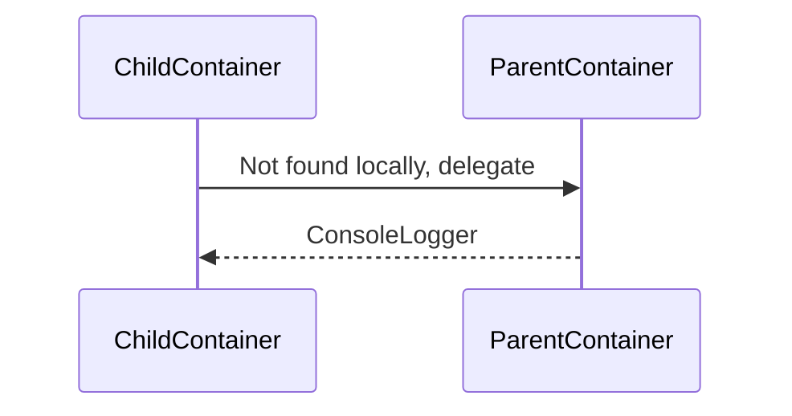
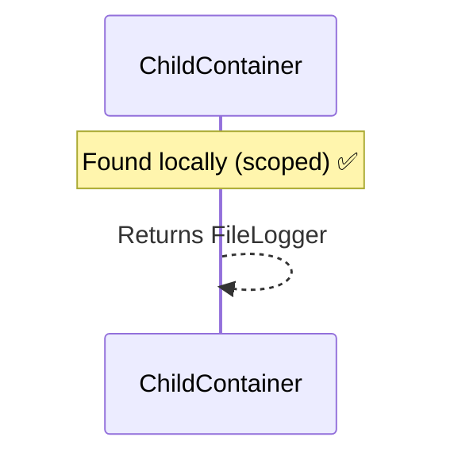
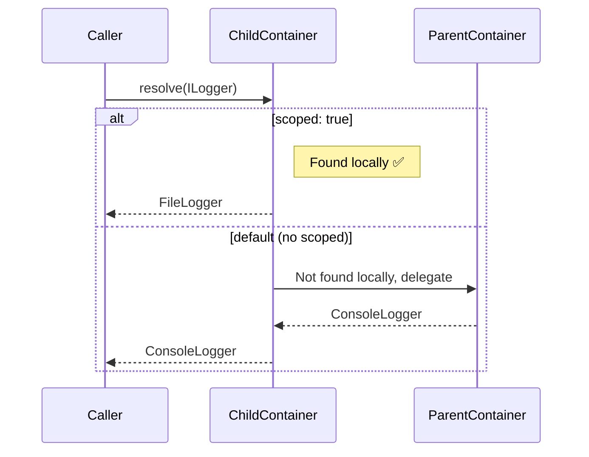

# Scoped Injections

Override parent container tokens with local resolution using `scoped: true`.

## The Problem

When you use a parent container with `useContainer`, you might want to **override** a token for your specific module:

```typescript
const parent = defineBuilderConfig({
  injections: [
    { token: useInterface<ILogger>(), provider: ConsoleLogger }
  ]
});

// ❌ This throws an error!
const child = defineBuilderConfig({
  useContainer: parent,
  injections: [
    { token: useInterface<ILogger>(), provider: FileLogger }  // Duplicate!
  ]
});
// Error: Duplicate registration: 'ILogger' is already registered in parent
```

## The Solution: `scoped: true`

Use `scoped: true` to tell NeoSyringe that this token should be **resolved locally** instead of delegating to the parent:

```typescript
const child = defineBuilderConfig({
  useContainer: parent,
  injections: [
    { 
      token: useInterface<ILogger>(), 
      provider: FileLogger,
      scoped: true  // ✅ Resolved in THIS container
    }
  ]
});
```

## How It Works

### Without `scoped: true`

Resolution delegates to the parent:



### With `scoped: true`

Resolution stays local:



## Visual Comparison



## Behavior Summary

| Aspect | Without `scoped` | With `scoped: true` |
|--------|------------------|---------------------|
| Token in parent | ❌ Duplicate error | ✅ Override allowed |
| Resolution | Delegates to parent | **Resolved locally** |
| Instance | Parent's instance | Container's own instance |
| Lifecycle | Parent's lifecycle | Can define different lifecycle |

## Use Cases

### 🧪 Testing

Override production services with mocks:

```typescript
// Production container
const production = defineBuilderConfig({
  injections: [
    { token: useInterface<IDatabase>(), provider: PostgresDatabase },
    { token: useInterface<IEmailService>(), provider: SendGridService },
    { token: UserService }
  ]
});

// Test container - override external services
const testing = defineBuilderConfig({
  useContainer: production,
  injections: [
    { token: useInterface<IDatabase>(), provider: InMemoryDatabase, scoped: true },
    { token: useInterface<IEmailService>(), provider: MockEmailService, scoped: true }
  ]
});

// UserService uses mocked dependencies
const userService = testing.resolve(UserService);
```

### 🔧 Module Isolation

Each module has its own instance of a shared token:

```typescript
const sharedKernel = defineBuilderConfig({
  injections: [
    { token: useInterface<ILogger>(), provider: ConsoleLogger }
  ]
});

// User module - wants file logging
const userModule = defineBuilderConfig({
  useContainer: sharedKernel,
  injections: [
    { token: useInterface<ILogger>(), provider: FileLogger, scoped: true },
    { token: UserService }  // Uses FileLogger
  ]
});

// Order module - wants console logging (from parent)
const orderModule = defineBuilderConfig({
  useContainer: sharedKernel,
  injections: [
    { token: OrderService }  // Uses ConsoleLogger from parent
  ]
});
```

### ⚙️ Different Lifecycle

Parent uses singleton, child uses transient:

```typescript
const parent = defineBuilderConfig({
  injections: [
    { token: useInterface<IRequestContext>(), provider: RequestContext, lifecycle: 'singleton' }
  ]
});

// Child needs new instance per request
const requestScoped = defineBuilderConfig({
  useContainer: parent,
  injections: [
    { 
      token: useInterface<IRequestContext>(), 
      provider: RequestContext,
      lifecycle: 'transient',  // Different lifecycle!
      scoped: true
    }
  ]
});
```

### 🔒 Encapsulation

Keep a local version without affecting other consumers:

```typescript
const shared = defineBuilderConfig({
  injections: [
    { token: useInterface<ICache>(), provider: RedisCache }
  ]
});

// This module needs its own cache
const isolatedModule = defineBuilderConfig({
  useContainer: shared,
  injections: [
    { 
      token: useInterface<ICache>(), 
      provider: MemoryCache,  // Local cache only
      scoped: true
    },
    { token: SensitiveService }
  ]
});

// Other modules still use RedisCache
const otherModule = defineBuilderConfig({
  useContainer: shared,
  injections: [
    { token: OtherService }  // Uses RedisCache
  ]
});
```

## Multi-Level Hierarchy

`scoped: true` works at any level:

```typescript
// Level 1: Infrastructure
const infrastructure = defineBuilderConfig({
  injections: [
    { token: useInterface<ILogger>(), provider: ConsoleLogger },
    { token: useInterface<IDatabase>(), provider: PostgresDatabase }
  ]
});

// Level 2: Domain (inherits all)
const domain = defineBuilderConfig({
  useContainer: infrastructure,
  injections: [
    { token: UserRepository }
  ]
});

// Level 3: Test (overrides only ILogger)
const test = defineBuilderConfig({
  useContainer: domain,
  injections: [
    { token: useInterface<ILogger>(), provider: MockLogger, scoped: true }
    // IDatabase still comes from infrastructure
  ]
});

test.resolve(useInterface<ILogger>());    // MockLogger (scoped)
test.resolve(useInterface<IDatabase>());  // PostgresDatabase (from infrastructure)
test.resolve(UserRepository);              // From domain
```

## Error Messages

When you forget `scoped: true`:

```
Error: Duplicate registration: 'ILogger' is already registered in the parent container.
Use 'scoped: true' to override the parent's registration intentionally.
```

The error message tells you exactly what to do! ✅

